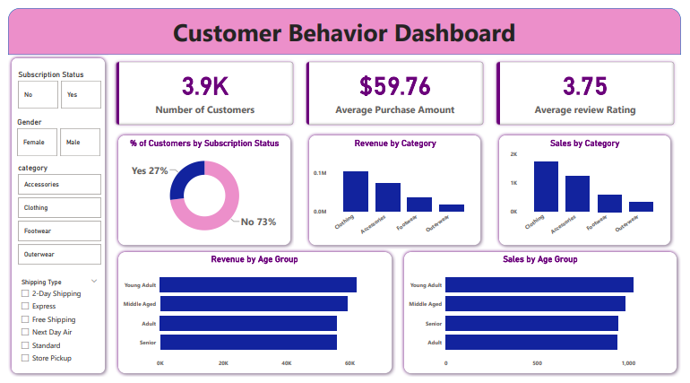

# Customer Shopping Behavior Analysis

An end-to-end Data Analytics project focused on analyzing customer purchasing behavior, revenue trends, and shopping patterns using SQL, Python, and Power BI.

This project demonstrates:

- Data Cleaning
- Exploratory Data Analysis (EDA)
- SQL-based Business Intelligence
- Dashboard Development
- Business Insight Generation
- Customer Segmentation

---

# 📌 Business Problem

Retail businesses often struggle to understand:

- Why customers purchase certain products
- Which customer groups generate maximum revenue
- How discounts affect profitability
- Which categories perform best
- What drives customer loyalty and repeat purchases

This project aims to solve these challenges using data-driven analysis and visualization techniques.

---

# 📊 Project Overview

This project analyzes 3,900+ customer shopping transactions to uncover:

- Customer purchasing patterns
- Revenue-driving categories
- Customer loyalty trends
- Subscription impact on sales
- Product performance insights
- Demographic-based shopping behavior

The workflow combines:

- SQL for business analysis
- Python for data cleaning & EDA
- Power BI for dashboard storytelling

---

# 🛠️ Tools & Technologies Used

## Programming & Analysis
- Python
- Pandas
- SQLAlchemy
- PyMySQL

## Database
- MySQL

## Visualization
- Power BI

## Development Environment
- Jupyter Notebook
- VS Code
- Git & GitHub

---

# 📁 Project Structure

```text
Customer-Shopping-Behavior-Analysis
│
├── Dataset
├── SQL
├── Python
├── PowerBI
├── Images
│   └── dashboard.png
├── Presentation
└── README.md
```

---

# 🔍 Key Analysis Performed

## Customer Analytics
- Customer segmentation
- Repeat purchase behavior
- Subscription impact analysis
- Spending pattern analysis

## Revenue Analysis
- Revenue by category
- Revenue by age group
- Gender-based revenue contribution
- Discount impact on sales

## Product Insights
- Top-performing products
- Highest-rated products
- Most purchased categories
- Seasonal purchasing behavior

## Operational Insights
- Shipping type analysis
- Purchase frequency trends
- Customer loyalty analysis

---

# 📈 Power BI Dashboard

## Dashboard Preview



---

# 📌 Dashboard Highlights

The interactive Power BI dashboard includes:

- KPI Cards for:
  - Total Customers
  - Average Purchase Amount
  - Average Review Rating

- Customer Subscription Analysis
- Revenue by Product Category
- Sales by Category
- Revenue by Age Group
- Sales by Age Group
- Interactive Filters:
  - Gender
  - Category
  - Shipping Type
  - Subscription Status

---

# 💡 Key Business Insights

- Loyal customers generated significantly higher revenue
- Subscription users showed better repeat purchase behavior
- Clothing category generated highest sales
- Adult and middle-aged customers contributed maximum revenue
- Discounts positively influenced purchasing frequency

---

# 🚀 Business Recommendations

Based on the analysis, the following strategies are recommended:

- Improve retention campaigns for repeat customers
- Focus marketing efforts on high-performing customer segments
- Optimize discount strategies to improve profitability
- Promote subscription programs for long-term customer value
- Improve targeting for underperforming categories

---

# ▶️ How to Run the Project

## Install Required Packages

```bash
pip install pandas sqlalchemy pymysql
```

## Run Jupyter Notebook

```bash
jupyter notebook
```

## Open Power BI Dashboard

Open:

```text
Customer_Behavior_Dashboard.pbix
```

using Power BI Desktop.

---

# 👨‍💻 Author

## Ayush Gupta

Aspiring Data Analyst passionate about transforming raw data into actionable business insights using SQL, Python, and Power BI.

---

# 🔗 Connect With Me

## LinkedIn
www.linkedin.com/in/ayush0307

## GitHub
github.com/AyushGupta-07

---

# ⭐ Project Highlights

✔ End-to-End Data Analytics Project  
✔ SQL + Python + Power BI Integration  
✔ Business Insights & Recommendations  
✔ Interactive Dashboard Storytelling  
✔ Real-World Customer Analytics Case Study  

---

# 📌 Future Improvements

- Add predictive analytics using Machine Learning
- Build customer churn prediction model
- Deploy dashboard online
- Add advanced KPI forecasting

---

# 📝 Conclusion

This project showcases practical data analytics skills including:

- Data Cleaning
- SQL Querying
- Business Intelligence
- Dashboard Development
- Customer Segmentation
- Insight Generation
- Business Problem Solving

The project reflects a real-world analytics workflow from raw data to business recommendations.